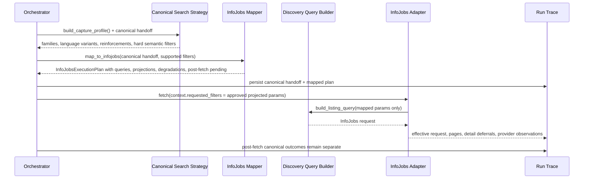

# Technical Design: InfoJobs Search Mapping

## Summary

This vertical inserts a provider-specific mapping layer between the canonical `capture profile` and the InfoJobs adapter request builder. Canonical families, languages, reinforcements, and semantic exclusions stay authoritative inside JobMatchRAG; InfoJobs params become projection artifacts with explicit trust labels, degradations, and audit traces.

## Goals

- Translate canonical role-intent families into auditable InfoJobs query plans.
- Keep bilingual families authoritative and Odoo adjacent-only.
- Distinguish pushdown, support-only hints, optimization-only params, and post-fetch semantics.
- Make semantic leakage impossible by structure, not by comments.

## Non-Goals

- Re-open canonical family semantics from `source-search-strategy`.
- Move eligibility, scoring, or checkpoint authority into InfoJobs params.
- Turn reinforcement technologies into primary search families.

## Architecture

### Proposed modules

| Path | Role |
|---|---|
| `src/jobmatchrag/source_ingestion/search_strategy.py` | Canonical family definitions and provider-agnostic handoff payloads only. |
| `src/jobmatchrag/source_ingestion/contracts.py` | Shared execution-plan/audit contracts used by orchestrator and adapters. |
| `src/jobmatchrag/source_ingestion/infojobs/mapping.py` | New provider mapper from canonical handoff to InfoJobs execution plan. |
| `src/jobmatchrag/source_ingestion/infojobs/discovery.py` | Request builder consumes only approved projected params from the mapping output. |
| `src/jobmatchrag/source_ingestion/orchestrator.py` | Builds canonical handoff, invokes InfoJobs mapper, stores full trace on the run. |
| `src/jobmatchrag/source_ingestion/infojobs/adapter.py` | Executes mapped queries and preserves request-vs-semantic traceability. |

### Boundary rule

`search_strategy.py` MAY describe intent; it MUST NOT emit provider-native semantics. `infojobs/mapping.py` MAY project intent into InfoJobs params; it MUST NOT redefine canonical meaning.

## Core flow



## Contracts and structures

### 1. Canonical handoff contract (authoritative)

New or expanded provider-agnostic structures should carry canonical meaning before projection:

```text
CanonicalFamilyIntent
- family_key                      # ai_automation | automation | adjacent_odoo
- intent_label                    # role-intent description
- role_variants[]                 # titles / phrases by intent
- language_variants[]             # ES baseline, EN baseline, optional mixed
- reinforcements[]                # Python, APIs, bots, LLM tooling as support/probe
- target_filters[]                # canonical filters still owned by JobMatchRAG
```

```text
LanguageVariant
- language                        # es | en | mixed
- baseline_terms[]
- mixed_with[]                    # only when language == mixed
- rationale                       # why this variant exists
```

```text
TechnologyReinforcement
- key
- terms[]
- mode                            # reinforcement | tactical_probe
- optional                        # true by default
```

### 2. InfoJobs execution contract (projection only)

`ProviderExecutionPlan` should be expanded or wrapped so each emitted query is explicit:

```text
InfoJobsExecutionPlan
- canonical_profile_ref
- family_plans[]
- post_fetch_filters[]
- degradation_notes[]
```

```text
InfoJobsFamilyPlan
- family_key
- language
- query_label                     # es-baseline | en-baseline | mixed-probe
- q_terms[]
- reinforcement_terms[]
- provider_params{}
- parameter_projections[]
- origin_exclusions[]
- degradations[]
- pending_post_fetch_checks[]
```

```text
ParameterProjection
- canonical_source                # family | geography_modality | seniority_semantic | freshness
- provider_param                  # q | experienceMin | sinceDate | category ...
- value
- trust_level                     # primary | partial_strong | contextual | support_only | optimization_only
- authority = canonical
- rationale
```

```text
MappingDegradation
- semantic_key
- reason_code
- kept_post_fetch_as
- severity                        # expected | notable
```

```text
OriginSideExclusion
- token
- reason
- aggressiveness = light
```

## Mapping rules

### Families and languages

- Families stay role-intent-based and bilingual.
- `adjacent_odoo` remains an adjacent family, never the default semantic axis.
- Each family emits at least ES baseline and EN baseline queries.
- Mixed queries are allowed only when explicitly justified in `rationale` and logged as mixed, never silently merged.

### `q` composition

- `q` is important but not exclusive.
- Baseline `q` is built from role-intent phrases first.
- Reinforcement technologies append or fork tactical probes; they do not define the family.
- Multiple narrower query variants are preferred over one overloaded `q` blob when auditability improves.

### Filter pushdown policy

| Provider param | Treatment | Design rule |
|---|---|---|
| `q` | important, non-exclusive | primary discovery hint anchored in canonical family intent |
| `experienceMin` | partial-but-strong | emit as hint, always keep semantic seniority post-fetch |
| `sinceDate` | optimization-only | never derived as semantic authority or checkpoint substitute |
| `category` / `subcategory` | contextual | use only to reduce noise around known families; never decide fit alone |
| `teleworking` | support-only | may support broad remote/hybrid narrowing, never final modality authority |
| geography params | reliable where explicit | use for clear Spain/Madrid constraints only; ambiguity stays post-fetch |

### Light origin-side exclusions

Allowed only for obviously bad query combinations that reduce known noise without narrowing product semantics aggressively. They MUST be:

- query-local, not family-global;
- recorded in `origin_exclusions`;
- reversible and reviewable;
- forbidden from replacing canonical hard exclusions.

## Semantic-leakage prevention

This is the critical risk of the vertical.

### Leakage vectors

1. treating `provider_params` as if they were the family definition;
2. collapsing language baseline and reinforcement into one opaque `q` string;
3. assuming `experienceMin`, `teleworking`, `category`, or `sinceDate` prove semantics;
4. storing only the final request and losing the canonical handoff.

### Boundary mechanisms

- Separate data structures for canonical intent vs projected params.
- `authority = canonical` on every projection record; provider params never carry authority.
- `trust_level` per param forces explicit interpretation in code and audits.
- `pending_post_fetch_checks` lists semantics still unresolved after pushdown.
- Run trace stores BOTH canonical handoff and effective InfoJobs request.
- Discovery builder receives only `provider_params`, never canonical families directly.

## Audit model

Each query trace should answer:

- which canonical family ran;
- which language baseline was used;
- which reinforcements/probes were added;
- which InfoJobs params were emitted and why;
- which params were partial/contextual/optimization-only;
- which degradations occurred;
- which semantic checks remain post-fetch.

The run-level `canonical_trace` should therefore keep:

- canonical handoff snapshot;
- mapped family plans;
- effective request per listing call;
- provider observations (`429`, pagination, detail deferrals);
- post-fetch filter outcomes separate from provider mapping.

## Implementation decisions

1. **Create `infojobs/mapping.py` instead of hiding mapping inside `search_strategy.py`.**  
   Rationale: provider projection must be isolated to prevent semantic leakage.

2. **Evolve `ProviderExecutionPlan` instead of replacing the run trace model.**  
   Rationale: current orchestrator and run models already carry an execution-plan slot.

3. **Keep `build_listing_query()` dumb.**  
   Rationale: request builders should serialize approved params, not make semantic decisions.

4. **Preserve post-fetch hard filters unchanged.**  
   Rationale: scoring and eligibility foundations depend on internal authority.

## Living docs alignment

| Doc | Update expectation from this vertical | Contract it carries |
|---|---|---|
| `docs/sources/infojobs-api-reference.md` | MUST update | provider param semantics/quirks, especially `q`, `experienceMin`, `sinceDate`, `category`/`subcategory`, `teleworking`, and trace expectations |
| `docs/architecture/ingestion-and-sources.md` | MUST update | framework boundary: canonical handoff vs provider projection, run trace split, pushdown/degradation model |
| `docs/architecture/scoring-foundation.md` | SHOULD update | reaffirm that source-side hints never replace hard filters or semantic authority before scoring |
| `docs/architecture/vertical-roadmap.md` | MUST update when status changes | reflect progress of `infojobs-search-mapping` and next recommended vertical |
| `docs/PRD-JobMatchRAG.md` | SHOULD update if wording remains too generic | product-level promise that capture stays role-intent-based and pushdown remains optimization/support |
| `docs/Open-Questions-Architecture-Decisions-JobMatchRAG.md` | CONDITIONAL | update only if this vertical resolves or creates a REAL open question; do not add backlog noise |

## Risks

| Risk | Impact | Mitigation |
|---|---|---|
| Provider params drift into semantic authority | High | hard split of contracts, trust labels, dual trace storage |
| Overfitted `q` queries miss adjacent good offers | High | bilingual baselines first, tactical probes second, degradations logged |
| Excessive exclusions reduce recall | Med | allow only light origin-side exclusions with audit trail |
| Trace payload becomes too opaque | Med | structured per-query records instead of free-text notes |

## Rollout / rollback

- Rollout behind the existing orchestration path by swapping the execution-plan builder from ad-hoc param filtering to explicit InfoJobs mapping.
- Rollback by restoring the prior `ProviderExecutionPlan` builder and removing the provider-specific mapping module and extended trace fields.
